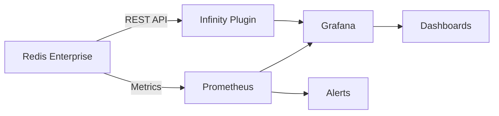

# Overview

Redis Enterprise Observability provides production-ready monitoring solutions for Redis Enterprise and Redis Cloud deployments.

## What This Repository Provides

### 📊 Monitoring Dashboards
Pre-built, tested dashboards for multiple observability platforms:
- Real-time performance metrics
- Capacity planning views
- Alert condition monitoring
- Historical trend analysis

### 🚨 Alerting Rules
Comprehensive alert configurations covering:
- Resource utilization thresholds
- Performance degradation detection
- Availability monitoring
- Replication health checks

### 🔧 Platform Integrations
Ready-to-deploy configurations for:
- Grafana + Prometheus
- Dynatrace
- New Relic
- Splunk
- Kibana

## Architecture Overview

## Why Use These Dashboards?

!!! success "Battle-Tested"
    These dashboards are used in production by Redis customers worldwide and are continuously updated based on real-world feedback.

### Time Savings
- **Weeks of development** condensed into minutes of setup
- **No guesswork** about which metrics matter
- **Best practices** built-in from day one

### Comprehensive Coverage
- **50+ metrics** monitored across all dashboards
- **Multi-level views** from cluster to shard level
- **Both performance and configuration** data included

### Platform Flexibility
Choose your preferred observability stack:
- Already using Grafana? Import our dashboards
- Dynatrace shop? We have extensions ready
- New Relic fan? Dashboard JSON included

## Quick Decision Guide

| If you want to... | Use this... |
|-------------------|-------------|
| Monitor Redis Enterprise Software | `grafana_v2/dashboards/software/` |
| Monitor Redis Cloud | `grafana_v2/dashboards/cloud/` |
| Set up alerting | `prometheus_v2/alert_rules/` |
| Add REST API data | [Infinity Plugin](../platforms/grafana/infinity-plugin.md) |
| Use Dynatrace | `dynatrace_v2/` |

## Next Steps

- [Quick Start Guide](quick-start.md) - Get monitoring in 5 minutes
- [Platform Installation](../platforms/grafana/installation.md) - Detailed setup instructions
- [Dashboard Catalog](../dashboards/catalog.md) - Browse all available dashboards