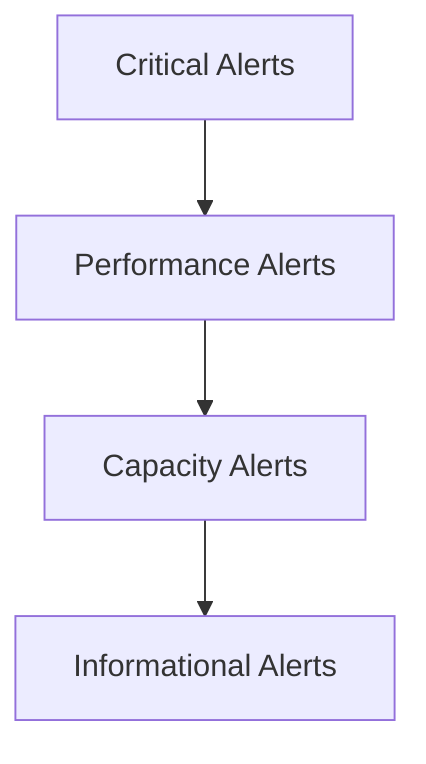

# Setting Up Alerting

Comprehensive guide for implementing alerting across your Redis Enterprise deployment.

## Alert Strategy

### Alert Hierarchy



1. **Critical** - Service impacting, immediate action
2. **Performance** - Degradation detected, investigate soon
3. **Capacity** - Planning required, schedule action
4. **Informational** - Awareness only, no action needed

## Prometheus Alert Configuration

### Installing Alert Rules

```bash
# Copy all alert rules
cp -r prometheus_v2/alert_rules/* /etc/prometheus/rules/

# Verify rules syntax
promtool check rules /etc/prometheus/rules/*.yml

# Reload Prometheus
curl -X POST http://localhost:9090/-/reload
```

### Alert Categories

#### Capacity Alerts
Monitor resource utilization:
- Memory usage > 80%
- Disk usage > 85%
- Connection limit approaching

#### Performance Alerts
Detect degradation:
- Latency > baseline + 2σ
- Throughput drop > 20%
- Error rate > 1%

#### Availability Alerts
Ensure uptime:
- Node down
- Shard offline
- Replication broken

## Alert Manager Setup

### Basic Configuration

```yaml
# alertmanager.yml
global:
  resolve_timeout: 5m

route:
  group_by: ['alertname', 'cluster', 'service']
  group_wait: 10s
  group_interval: 10s
  repeat_interval: 1h
  receiver: 'team-redis'
  
  routes:
  - match:
      severity: critical
    receiver: 'team-pager'
    continue: true
  
  - match:
      severity: warning
    receiver: 'team-slack'

receivers:
- name: 'team-redis'
  email_configs:
  - to: 'redis-team@company.com'

- name: 'team-pager'
  pagerduty_configs:
  - service_key: 'your-pagerduty-key'

- name: 'team-slack'
  slack_configs:
  - api_url: 'your-slack-webhook'
    channel: '#redis-alerts'
```

## Grafana Alert Configuration

### Creating Alerts in Grafana

1. **Open Dashboard** → Edit Panel
2. **Alert tab** → Create Alert
3. **Configure conditions**:
   ```
   WHEN avg() OF query(A, 5m, now) IS ABOVE 0.8
   ```
4. **Set notification channel**

### Notification Channels

#### Slack Integration
```json
{
  "url": "https://hooks.slack.com/services/YOUR/WEBHOOK/URL",
  "username": "Grafana",
  "icon_emoji": ":redis:",
  "mention_channel": "here"
}
```

#### PagerDuty Integration
```json
{
  "integrationKey": "YOUR-INTEGRATION-KEY",
  "severity": "critical",
  "class": "redis",
  "component": "database",
  "group": "production"
}
```

## Alert Examples

### Critical Alerts

```yaml
- alert: RedisDown
  expr: up{job="redis-enterprise"} == 0
  for: 1m
  labels:
    severity: critical
  annotations:
    summary: "Redis Enterprise node {{ $labels.instance }} is down"
    description: "Node has been unreachable for more than 1 minute"

- alert: DatabaseDown
  expr: bdb_up == 0
  for: 2m
  labels:
    severity: critical
  annotations:
    summary: "Database {{ $labels.bdb }} is down"
```

### Performance Alerts

```yaml
- alert: HighLatency
  expr: bdb_avg_latency > 1000
  for: 5m
  labels:
    severity: warning
  annotations:
    summary: "High latency on database {{ $labels.bdb }}"
    description: "Average latency {{ $value }}μs exceeds threshold"

- alert: LowThroughput
  expr: rate(bdb_total_req[5m]) < 1000
  for: 10m
  labels:
    severity: warning
  annotations:
    summary: "Low throughput on {{ $labels.bdb }}"
```

### Capacity Alerts

```yaml
- alert: HighMemoryUsage
  expr: (bdb_used_memory / bdb_memory_limit) > 0.8
  for: 5m
  labels:
    severity: warning
  annotations:
    summary: "Memory usage above 80% for {{ $labels.bdb }}"
    
- alert: ApproachingConnectionLimit
  expr: (bdb_conns / bdb_max_conns) > 0.9
  for: 5m
  labels:
    severity: warning
  annotations:
    summary: "Connection limit approaching for {{ $labels.bdb }}"
```

## Alert Tuning

### Reducing False Positives

1. **Use appropriate time windows**
   ```yaml
   expr: rate(errors[5m]) > 0.01  # Not [1m]
   for: 5m                         # Not 1m
   ```

2. **Set realistic thresholds**
   - Based on baseline metrics
   - Account for normal variations
   - Consider time of day/week

3. **Use inhibition rules**
   ```yaml
   inhibit_rules:
   - source_match:
       severity: 'critical'
     target_match:
       severity: 'warning'
     equal: ['cluster', 'bdb']
   ```

### Alert Fatigue Prevention

1. **Group related alerts**
2. **Implement alert summary dashboards**
3. **Regular alert review meetings**
4. **Automatic resolution where possible**

## Testing Alerts

### Manual Testing

```bash
# Trigger test alert
curl -X POST http://localhost:9090/api/v1/admin/test_alerts

# Check alert state
curl http://localhost:9090/api/v1/alerts | jq
```

### Load Testing Alerts

```yaml
# test_rules.yml
rule_files:
  - /path/to/rules/*.yml

tests:
  - interval: 1m
    input_series:
      - series: 'bdb_used_memory{bdb="1"}'
        values: '100 200 300 400 500'
      - series: 'bdb_memory_limit{bdb="1"}'
        values: '500 500 500 500 500'
    
    alert_rule_test:
      - eval_time: 5m
        alertname: HighMemoryUsage
        exp_alerts:
          - exp_labels:
              bdb: "1"
              severity: warning
```

## Alert Runbooks

### Standard Response Template

```markdown
## Alert: [Alert Name]

### Impact
- What is affected
- User impact assessment
- Business impact

### Diagnosis
1. Check metric: `[query]`
2. Verify in dashboard: [link]
3. Check logs: `[command]`

### Resolution
1. Immediate mitigation
2. Root cause investigation
3. Long-term fix

### Escalation
- After 15 minutes: Team lead
- After 30 minutes: On-call engineer
- After 1 hour: Management
```

## Best Practices

1. **Start with fewer alerts** - Add as needed
2. **Document every alert** - Include runbook
3. **Review alerts weekly** - Tune thresholds
4. **Track MTTD/MTTR** - Measure effectiveness
5. **Automate responses** - Where possible