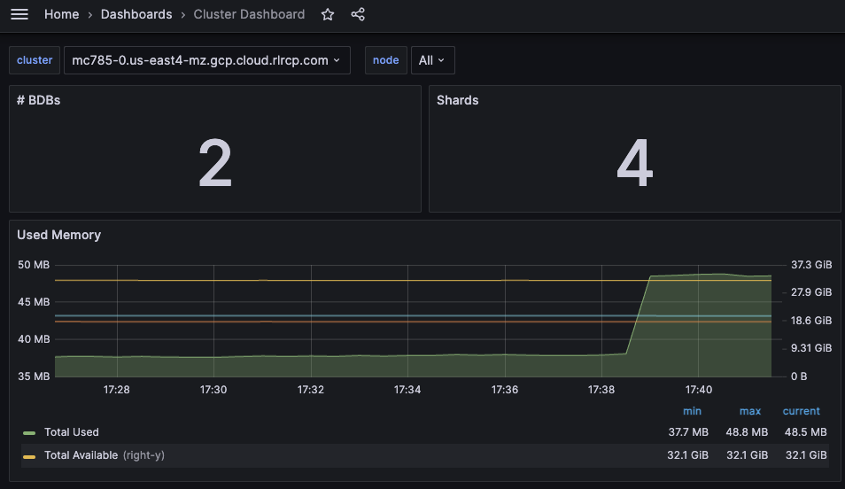
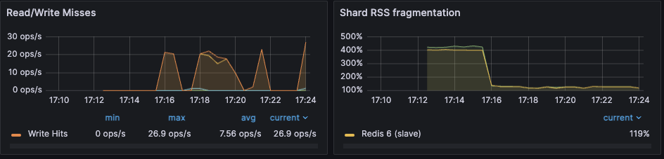
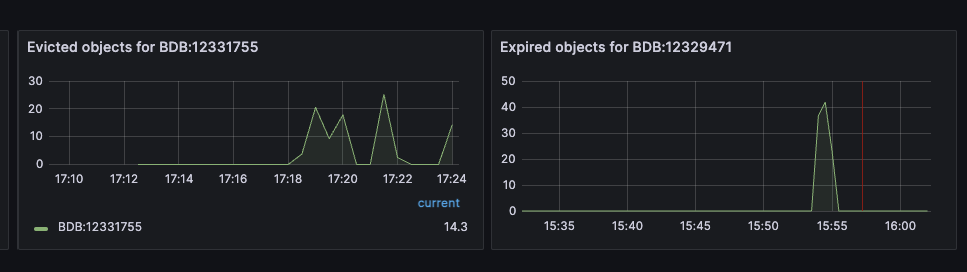

= Redis Enterprise Developer Observability Playbook
:revnumber: 1.0
:docinfo1:

== Introduction

This document provides monitoring guidance for developers running applications
that connect to Redis Enterprise. In particular, this guide focuses on the systems
and resources that are most likely to impact the performance of your application.

.Dashboard showing relevant statistics for a Node
image::images/node_summary.png[]

To effectively monitor a Redis Enterprise cluster you need to observe
core cluster resources and key database performance indicators.

Core cluster resources include:

* <<Memory, Memory utilization>>
* <<CPU, CPU utilization>>
* <<Connections, Database connections>>

Key database performance indicators include:

* <<Latency>>
* <<Cache hit rate>>
* <<Key eviction rate>>

.Dashboard showing an overview of cluster metrics
image::images/cluster_overview.png[]

== Core cluster resource monitoring

=== Memory

Every Redis Enterprise database has a maximum configured memory limit to ensure isolation
in a multi-database cluster.

[cols="1,1,1"]
|===
| *Metric name* | *Definition* | *Unit*

| Memory usage percentage | Percentage of used memory relative to the configured memory limit for a given database | Percentage
|===

==== Thresholds

The appropriate memory threshold depends on how the application is using Redis.

* <<Caching workloads>>, which permit Redis to evict keys, can safely use 100% of available memory.
* <<Non-caching workloads>> do not permit key eviction and should be closely monitored as soon as memory usage reaches 80%.

==== Caching workloads

For applications using Redis solely as a cache, you can safely let the memory usage
reach 100% as long as you have an https://redis.io/blog/cache-eviction-strategies/[eviction policy] in place. This will ensure
that Redis can evict keys while continuing to accept new writes.

While your Redis database is using 100% of available memory in a caching context,
it's still important to monitor performance. The key performance indicators include:

* Latency
* Cache hit ratio
* Evicted keys

===== Read latency

*Latency* has two important definitions, depending on context:

* In context Redis itself, latency is *the time it takes for Redis
to respond to a request*. See <<Latency>> for a broader discussion of this metric.

* In the context of your application, latency is *the time it takes for the application
to process a request*. This will include the time it takes to execute both reads and writes
to Redis, as well as calls to other databases and services. Note that its possible for
Redis to report low latency while the application is experiencing high latency.
This may indicate a low cache hit ratio, ultimately caused by insufficient memory.

You need to monitor both application-level and Redis-level latency to diagnose
caching performance issues in production.

===== Cache hit ratio and eviction

*Cache hit ratio* is the percentage of read requests that Redis serves successfully.
*Eviction rate* is the rate at which Redis evicts keys from the cache. These metrics
are often inversely correlated: a high eviction rate may cause a low cache hit ratio.

If the Redis server is empty, the hit ratio will be 0%. As the application runs and the fills the cache,
the hit ratio will increase.

*When the entire cached working set fits in memory*, then the cache hit ratio will reach close to 100%
while the percent of used memory will remain below 100%.

*When the working set cannot fit in memory*, the eviction policy will start to evict keys.
The greater the rate of key eviction, the lower the cache hit ratio.

In both cases, keys will may be manually invalidated by the application or evicted through
the uses of TTLs (time-to-live) and an eviction policy.

The ideal cache hit ratio depends on the application, but generally, the ratio should be greater than 50%.
Low hit ratios coupled with high numbers of object evictions may indicate that your cache is too small.
This can cause thrashing on the application side, a scenario where the cache is constantly being invalidated.

The upshot here is that when your Redis database is using 100% of available memory, you need
to measure the rate of
https://redis.io/docs/latest/operate/rs/references/metrics/database-operations/#evicted-objectssec[key evictions].

An acceptable rate of key evictions depends on the total number of keys in the database
and the measure of application-level latency. If application latency is high,
check to see that key evictions have not increased.

==== Non-caching workloads

If no eviction policy is enabled, then Redis will stop accepting writes once memory reaches 100%.
Therefore, for non-caching workloads, we recommend that you configure an alert at 80% memory usage.
Once your database reaches this 80% threshold, you should closely review the rate of memory usage growth.

==== Troubleshooting

|===
|*Issue* |*Possible causes* | *Remediation*

|Redis memory usage has reached 100%
|This may indicate an insufficient Redis memory limit for your application's workload
|For non-caching workloads (where eviction is unacceptable),
immediately increase the memory limit for the database.
You can accomplish this through the Redis Enterprise console or its API.
Alternatively, you can contact Redis support to assist.

For caching workloads, you need to monitor performance closely.
Confirm that you have an https://redis.io/docs/latest/operate/rs/databases/memory-performance/eviction-policy/[eviction policy]
in place.
If your application's performance starts to degrade, you may need to increase the memory limit,
as described above.

|Redis has stopped accepting writes
|Memory is at 100% and no eviction policy is in place
|Increase the database's total amount of memory.
If this is for a caching workload, consider enabling
an https://redis.io/docs/latest/operate/rs/databases/memory-performance/eviction-policy/[eviction policy]

In addition, you may want to determine whether the application can set a reasonable TTL (time-to-live) on some or all
of the data being written to Redis.

|Cache hit ratio is steadily decreasing
|The application's working set size may be steadily increasing.

Alternatively, the application may be misconfigured (e.g., generating
more than one unique cache key per cached item.)
|If the working set size is increasing, consider increasing the memory limit for the database.
If the application is misconfigured, review the application's cache key generation logic.

|===

=== CPU

Redis Enterprise provides several CPU metrics:

[cols="1,1,1"]
|===
| *Metric name* | *Definition* | *Unit*

| Shard CPU | CPU time portion spent by database shards  | Percentage, up to 100% per shard
| Proxy CPU | CPU time portion spent by the cluster's proxy(s) | Percentage, 100% per proxy thread
| Node CPU (User and System) | CPU time portion spent by all user-space and kernel-level processes | Percentage, 100% per node CPU
|===

To understand CPU metrics, it's worth recalling how a Redis Enterprise cluster is organized.
A cluster consists of one or more nodes. Each node is a VM (or cloud compute instance) or
a bare-metal server.

A database is a set of processes, known as shards, deployed across the nodes of a cluster.

In the dashboard, shard CPU is the CPU utilization of the processes that make up the database.
When diagnosing performance issues, start by looking at shard CPU.

.Dashboard displaying CPU usage
image::images/playbook_database-cpu-shard.png[]

==== Thresholds

In general, we define high CPU as any CPU utilization above 80% of total capacity.

Shard CPU should remain below 80%. Shards are single-threaded, so a shard CPU of 100% means that the shard is fully utilized.

.Display showing DMC Proxy CPU usage
image::images/playbook_proxy-cpu-usage.png[]

Proxy CPU should remain below 80% of total capacity.
The proxy is a multi-threaded process that handles client connections and forwards requests to the appropriate shard.
Because the total number of proxy threads is configurable, the proxy CPU may exceed 100%.
A proxy configured with 6 threads can reach 600% CPU utilization, so in this case,
keeping utilization below 80% means keeping the total proxy CPU usage below 480%.

.Dashboard displaying an ensemble of Node CPU usage data
image::images/node_cpu.png[]

Node CPU should also remain below 80% of total capacity. As with the proxy, the node CPU is variable depending
on the CPU capacity of the node. You will need to calibrate your alerting based on the number of cores in your nodes.

==== Troubleshooting

High CPU utilization has multiple possible causes. Common causes include an under-provisioned cluster,
excess inefficient Redis operations, and hot master shards.

|===
|*Issue*|*Possible causes*|*Remediation*

|High CPU utilization across all shards of a database
|This usually indicates that the database is under-provisioned in terms of number of shards.
A secondary cause may be that the application is running too many inefficient Redis operations.
You can detect slow Redis operations by enabling the slow log in the Redis Enterprise UI.
|First, rule out inefficient Redis operations as the cause of the high CPU utilization.
See <<Slow operations>> for details on this.
If inefficient Redis operations are not the cause, then increase the number of shards in the database.

|High CPU utilization on a single shard, with the remaining shards having low CPU utilization
|This usually indicates a master shard with at least one hot key.
Hot keys are keys that are accessed extremely frequently (e.g., more than 1000 times per second).
|Hot key issues generally cannot be resolved by increasing the number of shards.
To resole this issue, see <<Hot keys>>.

|High Proxy CPU
|There are several possible causes of high proxy CPU.
First, review the behavior of connections to the database.
Frequent cycling of connections, especially with TLS is enabled, can cause high proxy CPU utilization.
This is especially true when you see more than 100 connections per second per thread.
Such behavior is almost always a sign of a misbehaving application.

Seconds, review the total number of operations per second against the cluster.
If you see more than 50k operations per second per thread, you may need to increase the number of proxy threads.
|In the case of high connection cycling, review the application's connection behavior.

In the case of high operations per second, https://redis.io/docs/latest/operate/rs/references/cli-utilities/rladmin/tune/#tune-proxy[increase the number of proxy threads].

|High Node CPU
|You will typically detect high shard or proxy CPU utilization before you detect high node CPU utilization.
Use the remediation steps above to address high shard and proxy CPU utilization.
In spite of this, if you see high node CPU utilization, you may need to increase the number of nodes in the cluster.
|Consider increasing the number of nodes in the cluster and the rebalancing the shards across the new nodes.
This is a complex operation and should be done with the help of Redis support.

|High System CPU
|Most of the issues above will reflect user-space CPU utilization.
However, if you see high system CPU utilization, this may indicate a problem at the network or storage level.
|Review network bytes in and network bytes out to rule out any unexpected spikes in network traffic.
You may need perform some deeper network diagnostics to identify the cause of the high system CPU utilization.
For example, with high rates of packet loss, you may need to review network configurations or even the network hardware.
|===

=== Connections

The Redis Enterprise database dashboard indicates to the total number of connections to the database.

This connection count metric should be monitored with both a minimum and maximum number of connections in mind.
Based on the number of application instances connecting to Redis (and whether your application uses connection pooling),
you should have a rough idea of the minimum and maximum number of connections you expect to see for any given database.
This number should remain relatively constant over time.

|===
|*Issue*|*Possible causes*|*Remediation*

|Fewer connections to Redis than expected
|The application may not be connecting to the correct Redis database.
There may be a network partition between the application and the Redis database.
|Confirm that the application can successfully connect to Redis.
This may require consulting the application logs or the application's connection configuration.

|Connection count continues to grow over time
|Your application may not be releasing connections.
The most common of such a connection leak is a manually implemented
connection pool or a connection pool that is not properly configured.
|Review the application's connection configuration

|Erratic connection counts (e.g, spikes and drops)
|
|
|===

.Dashboard displaying connections
image::images/playbook_bdb-used-connections.png[]

==== Troubleshooting

|===
|*Issue*|*Possible causes*

|No client connections
|Poorly configured client

|Too many connections
|Poorly configured client
|===

==== Remediation

|===
|*Action*|*Method*

|Clients Misconfigured
|Confirm client configurations

|Networking issue
|From a client node TELNET to the endpoint and issue the PING command

|Too many connections
|Be sure that you are using pooling on your client library and that your pools are sized according

|Too many connections
|Using rladmin run "tune proxy PROXY_NUMBER threads VALUE"
|===

== Database performance indicators

=== Latency

Definition
redis_enterprise.avg_latency (unit: microseconds)

This is the average amount of time that a request takes to return from the time that it first hits the Redis Enterprise proxy until the response is returned.  It does not include the full time from the remote client’s perspective.

.Dashboard display of latency metrics
image::images/playbook_bdb-cluster-latency.png[]

==== Monitoring notes

Due to the fact that Redis is popular due to performance, generally you would expect most operations to return in single digit milliseconds.  Tune any alerts to match your SLA.  It is generally recommended that you also measure Redis operation latency at the client side to make it easier to determine if a server slow down or an increase in network latency is the culprit in any performance issues.

.Display showing a noticeable spike in latency
image::images/latency_spike.png[]

==== Troubleshooting

|===
|*Issue*|*Possible causes*

|Possible spike in requests
|Check both the Network Traffic and Operations Per Second metrics to determine if there is a corresponding increase

|Slow Running queries
|Check the slow log in the Redis Enterprise UI for the database

|Insufficient compute resources
|Check to see if the CPU Usage, Memory Usage Percentage, or Evictions are increasing
|===

.Cloud console slow log display
image::images/slow_log.png[]

==== Remediation
|===
|*Action*|*Method*

|Increase resources
|The database can be scaled up online by going to the Web UI and enabling clustering on the database.  In extreme cases more nodes can be added to the cluster and resources rebalanced.

|Inefficient Queries
|Redis allows you to view a slow log with a tunable threshold.  It can be viewed either in the Redis Enterprise UI or by running

redis-cli -h HOST -p PORT -a PASSWORD SLOWLOG GET 100
|===

=== Cache hit rate
Definition
redis_enterprise.cache_hit_rate (unit: percent)

This is the percentage of time that Redis is accessing a key that already exists.

==== Monitoring notes
This metric is useful only in the caching use case and should be ignored for all other use cases.
There are tradeoffs between the freshness of the data in the cache and efficacy of the cache mitigating traffic to any backend data service.
https://redis.io/glossary/cache-miss/[Cache misses] can have consequential impacts on system performance.
These tradeoffs should be considered carefully when determining the threshold for alerting.

.Dashboard showing Hit/Miss ratios

==== Troubleshooting
This is highly specific to the application caching with no general rules that are applicable in the majority of cases.

|===
|*Issue*|*Possible causes*

|Low hit rate
|Data is being evicted due to TTL policy
|===

==== Remediation
Note that redis commands return information on whether or not a key or field already exists.  For example, HSET command returns the number of fields in the hash that were added.

|===
|*Action*|*Method*

|Monitor activity
|Check return values to determine if values were added
|===

=== Key eviction rate

Definition
redis_enterprise.evicted_objects (unit: count)

This is the count of items that have been evicted from the database.

==== Monitoring notes
Eviction occurs when the database is close to capacity.  In this condition, the eviction policy starts to take effect.  While Expiration is fairly common in the caching use case, Eviction from the cache should generally be a matter of concern.  At very high throughput and very restricted resource use cases, sometimes the eviction sweeps cannot keep up with memory pressure.  Relying on Eviction as a memory management technique should be considered carefully.

.Dashboard displaying object evictions

==== Troubleshooting
While memory usage and network traffic will not help you pinpoint a root cause, network traffic is an excellent leading indicator of trouble.  Changes in network traffic patterns indicate corresponding changes in database behavior and further investigation is usually warranted.

|===
|*Issue*|*Possible causes*

|High number of evictions
|Increased number of network connections/clients
|===
*Also See Memory Usage Percentage Possible Causes

==== Remediation
See Memory Usage Percentage Remediation

|===
|*Action*|*Method*

|Reconfigure database
|Increase the number of shards
|Resize database
|Increase the memory limit of the database

|===

See Memory Usage Percentage Remediation
Secondary Indicators
Network Traffic
redis_enterprise.ingress_bytes/redis_enterprise.egress_bytes (unit: bytes)
Counters for the network traffic coming into the database and out from the database

== Data access anti-patterns

=== Slow operations

Any Redis operation whose performance is O(n) (or worse) can cause high CPU utilization.
Examples include https://redis.io/docs/latest/commands/keys/[KEYS], https://redis.io/docs/latest/commands/smembers/[SMEMBERS],
and https://redis.io/docs/latest/commands/lrem/[LREM].
In addition, certain operations such as https://redis.io/docs/latest/commands/keys/[KEYS] should never be issued against a production system due to the impact they have on performance.

=== Hot keys

Redis can easily become the core of your app’s operational data, holding valuable and frequently accessed information.
However, if you centralize the access down to a few pieces of data accessed constantly, you create what is known as a hot-key problem.
In a Redis cluster, the key is actually what determines where in the cluster that data is stored.
The data is stored in one single primary location based on hashing that key.
So, when you access a single key over and over again, you’re actually accessing a single node/shard over and over again.

== Alerting

Included in the Redis Observability package is a suite of alerts and their associated tests for use with Prometheus.
There are https://github.com/redis-field-engineering/redis-enterprise-observability/tree/main/grafana#alerts[alerts] for
all of the metrics described in both the Resources and the Performance sections below.

Not all the alerts are appropriate for all environments; installations that do not use persistence have no need of storage
alerts, for example.

There are https://github.com/redis-field-engineering/redis-enterprise-observability/tree/main/grafana/tests[tests] included
with the alerts that validate the individual triggers. These can be used to validate any modifications made when tailoring the
alerts for specific environments and/or use cases.

In order to trigger alerts it is necessary to install Prometheus' https://prometheus.io/docs/alerting/latest/configuration/[Alertmanager].
Grafana have published a fairly straightforward guide should you wish for more comprehensive https://grafana.com/blog/2020/02/25/step-by-step-guide-to-setting-up-prometheus-alertmanager-with-slack-pagerduty-and-gmail/[instructions] than what are provided below.

There are two sections of the 'prometheus.yml' file that must be configured, and by and large they can use the default values.
The first section should be un-commented, eg. everything below Alertmanager configuration.
This will start the Alertmanager and instruct it to listen on its default port of 9093.

[subs="+quotes"]
----
# Alertmanager configuration
#alerting:
#  alertmanagers:
#    - static_configs:
#        - targets:
#          - alertmanager:9093
----

The second section instructs the Alertmanager to read specific rules files. If you pasted the 'alerts.yml' file into '/etc/prometheus' then the following configuration would be required.

[subs="+quotes"]
----
# Load rules once and periodically evaluate them according to the global 'evaluation_interval'.
rule_files:
  - "error_rules.yml"
  - "alerts.yml"
----

Once this is done you should restart Prometheus.
The built-in configuration, error_rules.yml, has a single alert: Critical Connection Exception.
If you open the Prometheus console, by default located at port 9090, and select the Alert tab you should see it, as well as the alerts in any other file you have included as a rules file.

image::images/playbook_prometheus-alerts.png[]

The following is a list of alerts contained in the alerts.yml file. There are several points to be considered:

- Not all installations have all metrics
- Most metrics only alert if the specified trigger persists for a given duraction

|===
|Description |Trigger

|Average latency has reached a warning level
|round(bdb_avg_latency * 1000) > 1

|Average latency has reached a critical level indicating system degradation
|round(bdb_avg_latency * 1000) > 4

|Absence of any connection indicates improper configuration or firewall issue
|bdb_conns < 1

|A flood of connections has occurred that will impact normal operations
|bdb_conns > 64000

|Absence of any requests indicates improperly configured clients
|bdb_total_req < 1

|Excessive number of client requests indicates configuration and/or programmatic issues
|bdb_total_req > 1000000

|The database in question will soon be unable to accept new data
|round((bdb_used_memory/bdb_memory_limit) * 100) > 98

|The database in question will be unable to accept new data in two hours
|round((bdb_used_memory/bdb_memory_limit) * 100) < 98 and (predict_linear(bdb_used_memory[15m], 2 * 3600) / bdb_memory_limit) > 0.3 and round(predict_linear(bdb_used_memory[15m], 2 * 3600)/bdb_memory_limit) > 0.98

|Database read operations are failing to find entries more than 50% of the time
|(100 * bdb_read_hits)/(bdb_read_hits + bdb_read_misses) < 50

|In situations where TTL values are not set this indicates a problem
|bdb_evicted_objects > 1

|Replication between nodes is not in a satisfactory state
|bdb_replicaof_syncer_status > 0

|Record synchronization between nodes is not in a satisfactory state
|bdb_crdt_syncer_status > 0

|The amount by which replication lags behind events is worrisome
|bdb_replicaof_syncer_local_ingress_lag_time > 500

|The amount by which object replication lags behind events is worrisome
|bdb_crdt_syncer_local_ingress_lag_time > 500

|The expected number of active nodes is less than expected
|count(node_up) != 3

|Persistent storage will soon be exhausted
|round((node_persistent_storage_free/node_persistent_storage_avail) * 100) <= 5

|Ephemeral storage will soon be exhausted
|round((node_ephemeral_storage_free/node_ephemeral_storage_avail) * 100) <= 5

|The node in question is close to running out of memory
|round((node_available_memory/node_free_memory) * 100) <= 15

|The node in question has exceeded expected levels of CPU usage
|round((1 - node_cpu_idle) * 100) >= 80

|The shard in question is not reachable
|redis_up == 0

|The master shard is not reachable
|floor(redis_master_link_status{role="slave"}) < 1

|The shard in question has exceeded expected levels of CPU usage
|redis_process_cpu_usage_percent >= 80

|The master shard has exceeded expected levels of CPU usage
|redis_process_cpu_usage_percent{role="master"} > 0.75 and redis_process_cpu_usage_percent{role="master"} > on (bdb) group_left() (avg by (bdb)(redis_process_cpu_usage_percent{role="master"}) + on(bdb) 1.2 * stddev by (bdb) (redis_process_cpu_usage_percent{role="master"}))

|The shard in question has an unhealthily high level of connections
|redis_connected_clients > 500
|===

== Appendix A: Grafana Dashboards

Redis' Grafana dashboards are available tailored for Software(Enterprise) and Cloud installations.
They come in two flavors: basic, which has no third-party dependencies; and extended, which requires a third-party library to perform ReST calls.

There are two additional sets for software that provide drill-down functionality; the workflow dashboards.
Lastly there are legacy dashboards which can be found in Classic.

=== Software
- https://github.com/redis-field-engineering/redis-enterprise-observability/tree/playbook/grafana/dashboards/software/basic[Basic]
- https://github.com/redis-field-engineering/redis-enterprise-observability/tree/playbook/grafana/dashboards/software/extended[Extended]
- https://github.com/redis-field-engineering/redis-enterprise-observability/tree/playbook/grafana/dashboards/software/classic[Classic]

==== Workflow
- https://github.com/redis-field-engineering/redis-enterprise-observability/tree/playbook/grafana/dashboards/workflow/databases[Database]
- https://github.com/redis-field-engineering/redis-enterprise-observability/tree/playbook/grafana/dashboards/workflow/nodes[Node]

=== Cloud
- https://github.com/redis-field-engineering/redis-enterprise-observability/tree/playbook/grafana/dashboards/cloud/basic[Basic]
- https://github.com/redis-field-engineering/redis-enterprise-observability/tree/playbook/grafana/dashboards/cloud/extended[Exteneded]
