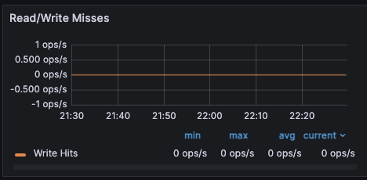

= Redis Enterprise Developer Observability Playbook
:revnumber: 1.0
:docinfo1:

== Introduction

This guide provides monitoring guidance for developers running applications that use
Redis Enterprise clusters either on premise or self-managed in the cloud.

== Monitoring Overview

== Alerting

Included in the Redis Observability package is a suite of alerts and their associated tests for use with Prometheus. There are https://github.com/redis-field-engineering/redis-enterprise-observability/tree/main/grafana#alerts[alerts] for all of the metrics described in both the Resources and the Performance sections below.

Not all the alerts are appropriate for all environments; installations that do not use persistence have no need of storage alerts, for example.

There are https://github.com/redis-field-engineering/redis-enterprise-observability/tree/main/grafana/tests[tests] included with the alerts that validate the individual triggers. These can be used to validate any modifications made when tailoring the alerts for specfic environments and/or use cases.

== Core System Resources

=== Memory

[cols="1,1,1"]
|===
| *Metric name* | *Definition* | *Unit*

| memory_usage_percent | Used memory / memory limit for database | Percentage
|===

Every Redis Enterprise database has a maximum configured memory limit to ensure isolation
in a multi-database cluster.

image::../images/playbook_used-memory.png[]

==== Thresholds

The appropriate memory threshold depends on how the application is using Redis.

===== Caching workloads

For applications using Redis solely as a cache, you can safely let the memory usage
reach 100% as long as you have an https://redis.io/blog/cache-eviction-strategies/[eviction policy] in place. This will ensure
that Redis can evict keys while continuing to accept new writes.

While your Redis database is using 100% of available memory, it's important to monitor
performance.

1. https://redis.io/docs/latest/operate/oss_and_stack/management/optimization/latency/[Latency]

Average latency should be at or below 1 ms.

2. Cache miss ratio should be below 50%

(100 * bdb_read_hits / (bdb_read_hits + bdb_read_misses)) < 50

The ideal cache miss ratio depends on the application, but generally, the ratio should fall below 50%.
High miss ratios coupled with high numbers of object evictions may indicate that your cache is too small.
This can cause thrashing on the application side, where the cache is constantly being invalidated.

3. https://redis.io/docs/latest/develop/reference/eviction/[Evicted keys]

bdb_evicted_objects > 1

Keys are being evicted from your database. In some caching use scenarios this may be acceptable, so please disable this check if you meet such requirements.

===== Non-caching workloads

If no eviction policy is enabled, then Redis will stop accepting writes once memory reaches 100%.
Therefore, for non-caching workloads, we recommend that you configure an alert at 80% memory usage.
Once your database reaches this 80% threshold, you should closely review the rate of memory usage growth.

==== Troubleshooting

|===
|*Issue* |*Possible causes*

|Possible spike in activity
|Check both the Network Traffic and Operations Per Second metrics to determine if there is a corresponding increase

|Database sized incorrectly
|View the Memory Usage raw bytes over time to see if a usage pattern has changed

|Incorrect retention policies
|Check to see if keys are being Evicted or Expired
|===

==== Remediation

|===
|*Action*|*Method*

|Increase database memory
|Raise the database memory limit using the Redis Enterprise console or its API.

|Modify eviction policy
|For workloads that can tolerate evicted keys (e.g., caching), configure a global eviction policy for your database.

|Modify key retention policy
|Determine whether the application can set a reasonable TTL (time-to-live) on some or all
of the data written to Redis.
|===

=== CPU

[cols="1,1,1"]
|===
| *Metric name* | *Definition* | *Unit*

| Node CPU (User and System) | CPU time portion spent by user-space processes | Percentage (values fall between 0 and 1, inclusive. Multiply by 100 to get percent)
| Proxy CPU | CPU time portion spent by user-space processes | Percentage (values fall between 0 and 1, inclusive. Multiply by 100 to get percent)
| Shard CPU | CPU time portion spent by user-space processes | Percentage (values fall between 0 and 1, inclusive. Multiply by 100 to get percent)
|===

To understand CPU metrics, it's worth recalling how a Redis Enterprise cluster is organized.
A cluster consists of one or more nodes. Each node is a VM (or cloud compute instance) or
a bare-metal server.

A database is a set of processes, known as shards, deployed across the nodes of a cluster.

In the dashboard, shard CPU is the CPU utilization of the processes that make up the database.
When diagnosing performance issues, start by looking at shard CPU.

image::../images/playbook_cpu-usage.png[]

==== Thresholds

Shard CPU should remain below 80%. Shards are single-threaded, so a shard CPU of 100% means that the shard is fully utilized.

Proxy CPU should remain below 80% of total capacity.
The proxy is a multi-threaded process that handles client connections and forwards requests to the appropriate shard.
Because the total number of threads is configurable, the proxy CPU may exceed 100%.
A proxy configured with 6 threads can reach 600% CPU utilization, so in this case,
keeping utilization below 80% means keeping it below 480%.

Node CPU should also remain below 80% of total capacity. As with the proxy, the node CPU is variable depending
on the CPU capacity of the node.

==== Troubleshooting

High CPU utilization is generally caused by an under-provisioned cluster, excess inefficient Redis operations,
or hot master shards.

|===
|*Issue*|*Possible causes*

|High CPU utilization across all shards of a database
|This indicates that the database is under-provisioned. Increase the number of shards.

|Hot Master Shard
|Inefficient usage

|High Proxy CPU
|Thundering herd of TLS connections
|===

==== Remediation

|===
|*Action*|*Method*

|Improve distribution
|Increase number of shards

|Increase database memory
|Raise the database memory limit using the Redis Enterprise console or its API.

|Modify eviction policy
|For workloads that can tolerate evicted keys (e.g., caching), configure a global eviction policy for your database.

|Modify key retention policy
|Determine whether the application can set a reasonable TTL (time-to-live) on some or all
of the data written to Redis.
|===

=== Connections

Definition
redis_enterprise.conns (unit: count)
The count of current client connections to the database.

==== Monitoring notes
This metric should be monitored with both a minimum and maximum number of connections.  The minimum number of connections not being met is an excellent indicator of either networking or application configuration errors.  The maximum number of connections being exceeded may indicate a need to tune the database.
Possible Causes

|===
|*Cause*|*Explanation*|*Actions*

|Minimum clients not met| Incorrect client configuration, network firewall or network issues|Check client configurations and firewall settings
|Maximum connections exceeded|Client library is not releasing connections or an increase in the number of clients|Check client application configurations
|===

image::../images/playbook_connections.png[]

==== Troubleshooting

|===
|*Issue*|*Possible causes*

|No client connections
|Poorly configured client

|Too many connections
|Poorly configured client
|===

==== Remediation

|===
|*Action*|*Method*

|Clients Misconfigured
|Confirm client configurations

|Networking issue
|From a client node TELNET to the endpoint and issue the PING command

|Too many connections
|Be sure that you are using pooling on your client library and that your pools are sized according

|Too many connections
|Using rladmin run "tune proxy PROXY_NUMBER threads VALUE"
|===

=== Storage

Installations that use Redis' persistence feature will also want to monitor available disk space to ensure availability.

==== Troubleshooting

|===
|*Issue*|*Possible causes*

|===

==== Remediation

|===
|*Action*|*Method*

|===

== Performance measures

=== Latency

Definition
redis_enterprise.avg_latency (unit: microseconds)

This is the average amount of time that a request takes to return from the time that it first hits the Redis Enterprise proxy until the response is returned.  It does not include the full time from the remote client’s perspective.

==== Monitoring notes

Due to the fact that Redis is popular due to performance, generally you would expect most operations to return in single digit milliseconds.  Tune any alerts to match your SLA.  It is generally recommended that you also measure Redis operation latency at the client side to make it easier to determine if a server slow down or an increase in network latency is the culprit in any performance issues.

image::../images/playbook_latency.png[]

==== Troubleshooting

|===
|*Issue*|*Possible causes*

|Possible spike in requests
|Check both the Network Traffic and Operations Per Second metrics to determine if there is a corresponding increase

|Slow Running queries
|Check the slow log in the Redis Enterprise UI for the database

|Insufficient compute resources
|Check to see if the CPU Usage, Memory Usage Percentage, or Evictions are increasing
|===

==== Remediation
|===
|*Action*|*Method*

|Increase resources
|The database can be scaled up online by going to the Web UI and enabling clustering on the database.  In extreme cases more nodes can be added to the cluster and resources rebalanced.

|Inefficient Queries
|Redis allows you to view a slow log with a tunable threshold.  It can be viewed either in the Redis Enterprise UI or by running

redis-cli -h HOST -p PORT -a PASSWORD SLOWLOG GET 100
|===

=== Cache Hit Rate
Definition
redis_enterprise.cache_hit_rate (unit: percent)

This is the percentage of time that Redis is accessing a key that already exists.

==== Monitoring notes
This metric is useful only in the caching use case and should be ignored for all other use cases.  There are tradeoffs between the freshness of the data in the cache and efficacy of the cache mitigating traffic to any backend data service.  These tradeoffs should be considered carefully when determining the threshold for alerting.

==== Troubleshooting
This is highly specific to the application caching with no general rules that are applicable in the majority of cases.

|===
|*Issue*|*Possible causes*

|Low hit rate
|Data is being evicted due to TTL policy
|===

==== Remediation
Note that redis commands return information on whether or not a key or field already exists.  For example, HSET command returns the number of fields in the hash that were added.

|===
|*Action*|*Method*

|Monitor activity
|Check return values to determine if values were added
|===

=== Evictions
Definition
redis_enterprise.evicted_objects (unit: count)

This is the count of items that have been evicted from the database.

==== Monitoring notes
Eviction occurs when the database is close to capacity.  In this condition, the eviction policy starts to take effect.  While Expiration is fairly common in the caching use case, Eviction from the cache should generally be a matter of concern.  At very high throughput and very restricted resource use cases, sometimes the eviction sweeps cannot keep up with memory pressure.  Relying on Eviction as a memory management technique should be considered carefully.

image::../images/playbook_evicted-objects.png[]

==== Troubleshooting
While memory usage and network traffic will not help you pinpoint a root cause, network traffic is an excellent leading indicator of trouble.  Changes in network traffic patterns indicate corresponding changes in database behavior and further investigation is usually warranted.

|===
|*Issue*|*Possible causes*

|See Memory Usage Percentage Possible Causes
|===

==== Remediation
See Memory Usage Percentage Remediation

|===
|*Action*|*Method*

|===

See Memory Usage Percentage Remediation
Secondary Indicators
Network Traffic
redis_enterprise.ingress_bytes/redis_enterprise.egress_bytes (unit: bytes)
Counters for the network traffic coming into the database and out from the database

=== Proxy

In addition to automatic shard migration, Redis Enterprise offers additional capabilities. The DMC proxy can automatically scale the number of threads, starting from a default number up to a maximum and according to configurable criteria (threshold and duration).

==== Monitoring notes

If a node cannot host all the shards, one or more shards can spill over to another node due to resource insufficiency. Still, the placement policy doesn't change: there is an attempt to keep as many shards as possible on the same node. Always keeping the limit, hardcoded, of 10 shards per CPU.

image::../images/playbook_proxy-cpu-usage.png[]

==== Troubleshooting

|===
|*Issue*|*Possible causes*

|Poor Performance|Thundering herd
|Auto-scale event|Insufficient threads
|High ops per second/thread|Insufficient threads
|===

==== Remediation
|===
|*Action*|*Method*

|Increase thread count|
|Restart the proxy|
|===

=== Replication

In Redis Enterprise, Active-Active geo-distribution is based on CRDT technology. The Redis Enterprise implementation of CRDT is called an Active-Active database (formerly known as CRDB). With Active-Active databases, applications can read and write to the same data set from different geographical locations seamlessly and with latency less than one millisecond (ms), without changing the way the application connects to the database.

Active-Active databases also provide disaster recovery and accelerated data read-access for geographically distributed users.

==== Monitoring notes

Clustering and replication are used together in Active-Active databases to distribute multiple copies of the dataset across multiple nodes and multiple clusters. As a result, a node or cluster is less likely to become a single point of failure. If a primary node or primary shard fails, a replica is automatically promoted to primary. To avoid having one node hold all copies of certain data, the replica HA feature (enabled by default) automatically migrates replica shards to available nodes.

==== Troubleshooting

|===
|*Issue*|*Possible causes*

|Constant Syncing|Unreliable Networking
|Lag|
|===

==== Remediation
|===
|*Action*|*Method*

|===
