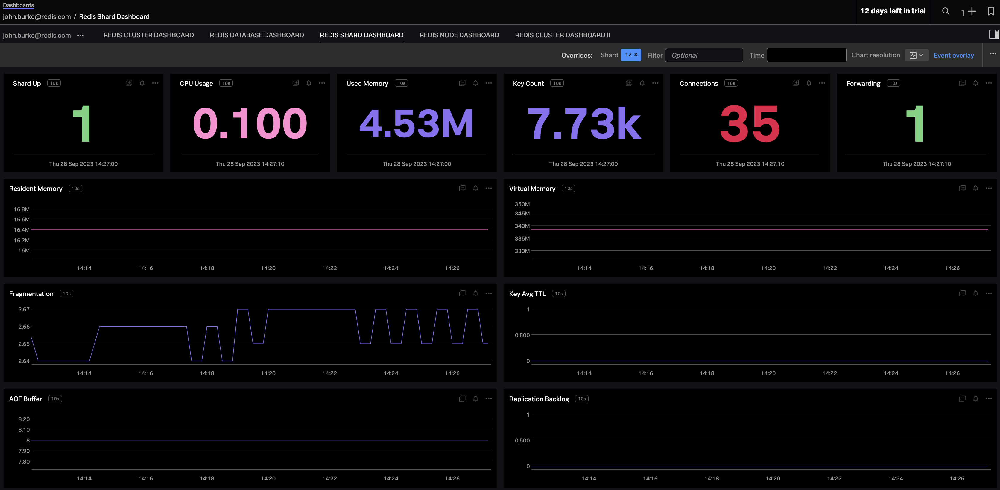

:linkattrs:
:project-owner:      redis-field-engineering
:project-name:       redis-enterprise-observability

= Observe Redis Enterprise with Splunk

To collect metrics in Splunk from Redis Enterprise Software or Redis Cloud, use the https://docs.splunk.com/observability/en/gdi/opentelemetry/opentelemetry.html[Splunk OpenTelemetry Collector].

You can run the Splunk Collector in any environment that can connect with your Redis cluster. For Redis Cloud deployments, your Splunk environment must be https://docs.redis.com/latest/rc/security/vpc-peering/[VPC-peered] with your Redis Cloud subscription.

== Table of Contents

* link:#Requirements[Requirements]
* link:#Installation[Installation]
* link:#Dashboards[Dashboards]
* link:#Support[Support]
* link:#License[License]

== Requirements

To collect Redis Enterprise metrics from Splunk, you will need:

* A Redis Enterprise deployment or a Redis Cloud account with a https://docs.redis.com/latest/rc/subscriptions/create-flexible-subscription/[Flexible or Annual subscription]
* A https://www.splunk.com/en_us/products/infrastructure-monitoring.html[Splunk account]
* An installation of the https://docs.splunk.com/observability/en/gdi/opentelemetry/install-the-collector.html[Splunk Distrubtion of the OpenTelemetry Collector]

If you're using Redis Enterprise Software, you will need the fully-qualified domain name for your cluster.

If you're using Redis Cloud, you will need:

* The https://docs.redis.com/latest/rc/databases/view-edit-database/[private endpoint] for one of the databases associated with your Redis Cloud subscription. This private endpoint will look something like this: `redis-12345.internal.c67890.us-central1-1.gcp.cloud.rlrcp.com:121212`.
* A https://docs.redis.com/latest/rc/security/vpc-peering/[VPC-peering] between the infrastructure running your Splunk Collector and Redis Cloud

== Installation

To get started, first follow the https://docs.splunk.com/observability/en/gdi/opentelemetry/install-linux.html#otel-install-linux[instructions for installing and deploying the Splunk Distrubtion of the OpenTelemetry Collector].

Next, edit the Splunk agent's configuration file: `/etc/otel/collector/agent_config.yaml`

This repository contains a sample link:/splunk/config/agent_config.yml[agent_config.yml] that you can reference when configuring your agent.

To collect Redis metrics, you need to add a new receiver under `receivers` that looks like the following:

```
prometheus:
  config:
    scrape_configs:
    - job_name: 'redis-collector'
    scrape_interval: 5s
    metrics_path: /
    scheme: https
    tls_config:
        insecure_skip_verify: true
    static_configs:
        # The default port for Redis Enterprise metrics is 8070
        - targets: ["REDIS_ENTERPRISE_HOST:8070"]
```

Replace `REDIS_ENTERPRISE_HOST` with the hostname if your cluster. For Redis Enterprise Software, this is the fully-qualified domain name of the cluster.

For Redis Cloud, this is the private endpoint with the segment before the first dot removed. For example, if your Redis Cloud private endpoint is

`redis-12345.internal.c67890.us-central1-1.gcp.cloud.rlrcp.com:121212`.

then the hostname to set in your collector config is

`internal.c67890.us-central1-1.gcp.cloud.rlrcp.com:121212`.

To ensure network connectivity, the the Splunk collector must run within a network that is https://docs.redis.com/latest/rc/security/vpc-peering/[VPC-peered] with your Redis Cloud subscription.

== Dashboards

This respository includes sample Splunk dashboards for monitoring your Redis deplyoment. See the link:/splunk/dashboards[dashboards] folder for the available set of dashboards.



== Support

Support for metrics collection for Redis Enterprise with Splunk is provided on a good faith effort basis by Redis. Inc. To report bugs, request features, or receive assistance, please https://github.com/{project-owner}/{project-name}/issues[file an issue].

== License

This code in this repository is licensed under the MIT License. Copyright (C) 2023 Redis, Inc.
